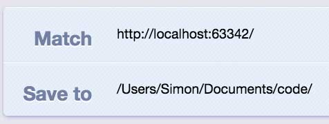

The developer tools from Chrome are just awesome. You can do and see so many things, like inspecting the DOM, debugging your javascript with the console, checking your resources, etc.

One of the features I use a lot is changing css attributes to see the effects live. That’s especially useful if you want to experiment a little, because you don’t have to constantly change your view between your editor and the browser, but once you are satisfied it can be quite a pain to translate all your changes to your stylesheet, because it’s hard to keep track of your modifications, particularly if you manipulated a lot of different elements.

This week I came across an extension that addresses this problem. It’s called DevTools Autosave and it saves your css and js changes from the browser directly to your local files. This allows you to design completely in the browser, see your css attributes instantly in action and removes the efforts of copying or downloading the finished stylesheet.

There is a downside as well. The extension can only change the files which are used to render the site, which are your css files. If your workflow includes preprocessor like SASS or Coffeescript, autosave won’t work, because even if you change your css or js files, the core files won’t be altered and the next time you compile them everything will be reverted.

The other disadvantage that I can think of emerges from one of the benefits. If the plugin is active, you can’t just experiment as much as you would like to, because everything you change will be a permanent modification of your local files. So be careful not to break your code.

# The installation
The installation is a bit more complex than the usual chrome extension, due to the fact that it has to be allowed to access your local files and overwrite them.

First you have to install the extension itself, which shouldn’t be a problem. Than you need to install the autosave server as well. To do that you first need node.js installed globally on your machine. Once this is done, open your Terminal and run ```npm install -g autosave```, this will take a few seconds (if you see an error occur, try prepending „sudo“).

Basically you are good to go now, just run „autosave“ to start the service and changes should be applied automatically. Once you are finished working you can stop the server from running with ```ctrl + c```.

## Using a localhost environment
The basic setup does only work if you’re developing completely local without a localhost. If you want to use autosave in combination with a localhost you have to do some additional configuration. Go to your Chrome settings and open the section with all your extensions. Then open the options of autosave and you will see the routing and mapping from the plugin. The example on the top is the configuration required to autosave local files. If you need your localhost as well, simply create a new route by clicking into the blank form under the existing one.


<figure>
	
	<figcaption>example settings for the configuration of a localhost.</figcaption>
</figure>

You have to fill in two paths. The first one („Match“) is the url of your localhost, while the other one („Save To“) represents the root path of your files, so the extensions knows where your project is located (see image). At last you have to drag and drop the connection from the route to the server url on the right.
Now you’re set up and the plugin should work properly, you can add as many routes as you need.
To see the original documentation and the github project click [here](https://github.com/NV/chrome-devtools-autosave).