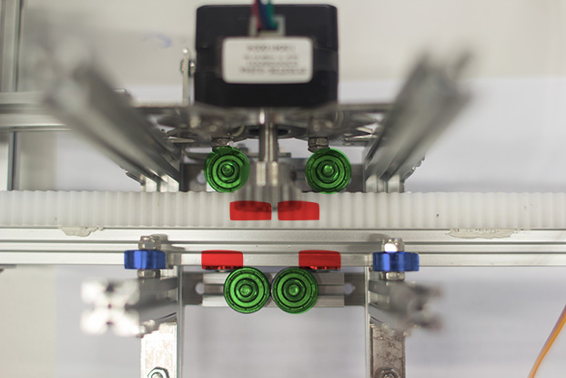
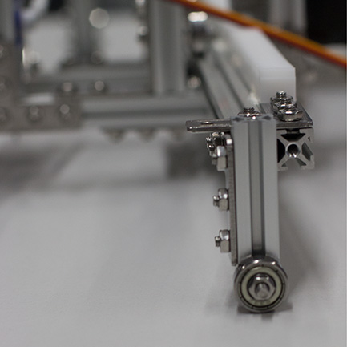
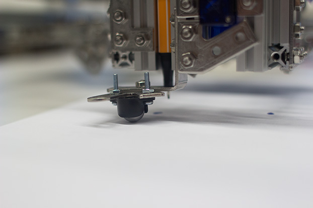
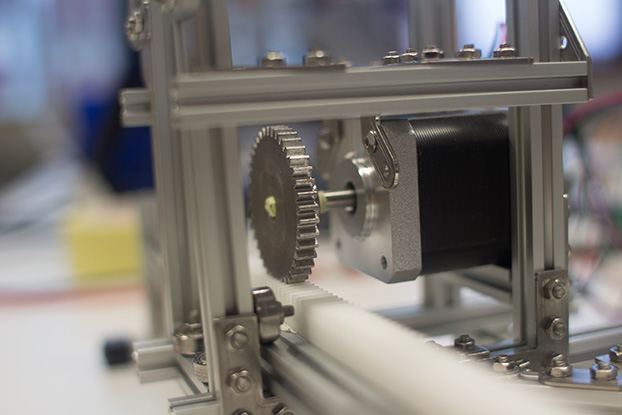
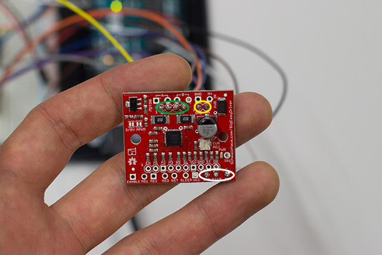
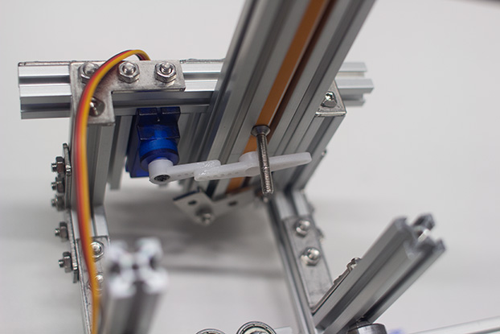
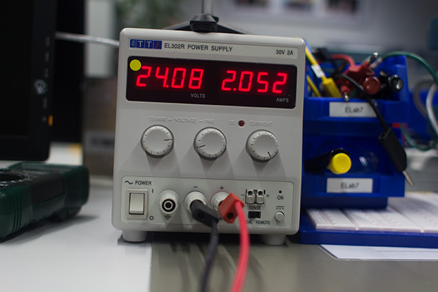
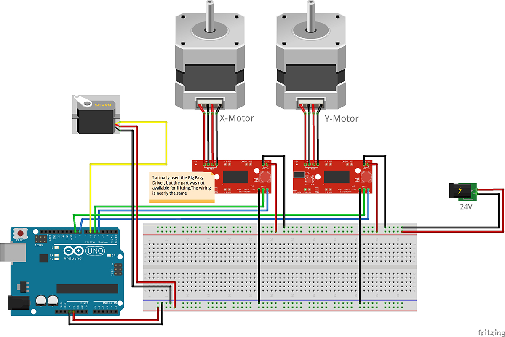

This is the documentation for a school project I did. The task was to build an interactive installation. My result is a X/Y- Plotter that draws a picture from a Webcam. The project was realized with Arduino (hardware) and Processing (software). The inspiration for the design of the plotter was from another [project](http://roxen.github.io/live-plotter/), I found on the web.

See it in action:
<p>
<iframe width="100%" height="315"  src="https://www.youtube.com/embed/eJAnOWJo8qk" frameborder="0" allowfullscreen></iframe>
</p>

## Structure of the hardware
For basic structure I used the MakerBeam Starter Kit. I never worked with this kind of components before, but it was a good experience. Everything was mounted easily, it actually felt a bit like building something with Lego.

### Ball bearings
Additionally to the MakerBeam Starter kid I needed some ball bearings to secure smooth movement of the sleighs with the motors attached. Each sleigh is constructed using 10 bearings, four underneath, four at the sides and two on top of the arm. The Y-arm is supported by another bearing at the end.

<figure>
    </img>
    <figcaption>Each sleigh is supported by 10 bearings: four on the sides (green), four underneath (red) and two on top (blue)</figcaption>
</figure>

<figure>
    </img>
    <figcaption>At the end of the Y-arm a bearing supports the weight of the construction</figcaption>
</figure>

To make sure the sleigh on the Y-arm doesn’t shake to much and relieve the weight from the top bearings and gear wheel, I added a support wheel on the side with the pen.

<figure>
    </img>
    <figcaption>To lift the heavy part of the y-sleigh, I added a little support wheel</figcaption>
</figure>

### Gear Wheels and Steering Racks
The two gear wheels I use are not the same (the diameters are 42mm and 15mm), which I cannot recommend, because it leads to different length of motor steps. The motors I use also require a different amount of steps for a full rotation (the big one needs 400 while the smaller only requires 200 steps/full rotation). Due to that I had to experiment a little to find the approximate ratio between the X- and the Y-axis. In my case I figured out that, if I do 100 steps with the big motor, I needed about 130 steps with the small one to move the same length. This could have been avoided if the motors had the same specifications in terms of step angle and the same gear wheels.

Some technical information: Both gear wheels are module 1 and have a mounting hole of 6mm. The motor shaft has a diameter of 5mm. To fix that difference I used some masking tape and grub screws, which were already provided.

The [steering racks](https://www.conrad.at/de/acetalharz-zahnstange-modul-typ-10-l-x-b-x-h-250-x-9-x-9-mm-237396.html) were attached with some glue pads.

<figure>
    </img>
    <figcaption>It was a mistake buying such big gears… You never stop learning ;)</figcaption>
</figure>

### Motors
The key parts of the machine are two stepper motors. A big one (NEMA-17) for the X-axis and one smaller (NEMA-14), due to weight issues, for the Y-axis. These motors have enough power to ensure a smooth and exact movement.

Stepper motors can’t be powered by an Arduino. They need special drivers, which require a higher voltage than the Arduino can provide, to control the proper current. Working with the [Big Easy Driver](https://www.sparkfun.com/products/12859) from Sparkfun was very easy. I followed their [Hookup Guide](https://learn.sparkfun.com/tutorials/big-easy-driver-hookup-guide) for connecting the motors to my Arduino ports, which is well documented.

<figure>
    </img>
    <figcaption>Each stepper motor requires a motor driver. The green surrounded pins are connected to the motor, the yellow ones to the power supply and the white ones to the Arduino</figcaption>
</figure>

Finally I used a small servomotor for lifting the pen up and down. The pen is guided between some beams and I glued a screw onto it. To lift it up the servomotor lifts the screw and the pen loses contact to the canvas. To draw it just falls down. This design ensures proper pressure which would be harder to accomplish with a solid connection of the pen.

<figure>
    </img>
    <figcaption>The servomotor lifts the screw, which is attached to the pen.</figcaption>
</figure>

### Power Supply
As mentioned earlier the motor drivers need more voltage than the Arduino can provide. Therefore I use a power supply with 24V. The drivers have an potentiometer implemented that allows you to set the current for the motors. They can be any value between 0 and 2A. The datasheets of the motors contain the information about the maximum current possible, but I just slowly increased it up to the point where both of them rotated smoothly.

<figure>
    </img>
    <figcaption>The motor drivers require more power than the Arduino can provide. I use an external power supply with 24V</figcaption>
</figure>

### Arduino
The Arduino setup is rather simple. Each stepper motor needs two ports, one for direction and one for the steps plus a ground connection. The servomotor gets the power from the Arduino and needs one port for the position.

<figure>
    </img>
    <figcaption>Schematic of the electrical parts. Generated with <a href="www.fritzing.org">fritzing</a>.</figcaption>
</figure>

## Software

To see the actual code, please visit my [github repository](https://github.com/abisz/Webcam-Plotter).

### Arduino: hardware control
The code for controlling the hardware (= the motors) receives the position of the next point from the image processing program through the serial port. Additionally I send an extra byte to indicate whether the next point should be drawn or just moved to (this simply changes the position of the servomotor). Controlling the stepper motors is easy. You just have to send one signal per step and another signal to declare the direction.

I couldn’t figure out how to give feedback when the action is completed and the arduino is ready for the next command, so the other program has to have some kind of delay.

### Processing: image processing with openCV
The processing and detection of the contours is made with the openCV library, which is already included in the default download of Processing. To get an ArrayList of all contours found by the algorithm you just have to call:


```contours = opencv.findContours();```

After that, you can simply go through all contours with an foreach loop and access every point individually. There is even a demo example already included in the library that does exactly that. I basically just added a command to send the position of the point to the arduino and forced a delay depending on the distance from the previous point to make sure the arduino has enough time to go there.

For a better handling of the output, I included some control possibilities to change the threshold, smoothness and exclusion of very small contours.

## Conclusion
This project was a lot of fun and I learned a lot, but it was also very time consuming. The programming wasn’t a problem. The really hard part was to work precisely enough while putting everything together. I had to build most parts several times because the movement wasn’t smooth enough to work properly. I really enjoyed this kind of programming and creativity a lot and hope I’ll soon find time for another project like that.
