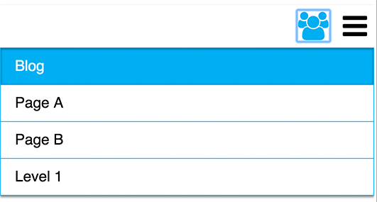
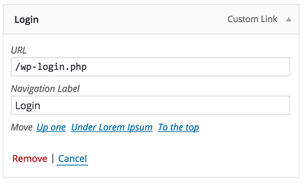

In this tutorial I want to show you my attempt on how to make a separated menu, which is only visible for logged-in users, in WordPress.

Be warned, a few things are far away from best practices, but they work for me. If you have any suggestions for improvements, please let me know!

I’m going to use a blank underscore_s theme with sass for this tutorial. If you never worked with node packages or sass before, you can also use the default settings. If you don’t know what [underscore_s](http://underscores.me/) is, visit another [post](http://www.piedcode.com/creating-a-wordpress-theme-using-underscore_s/) from me, where I explain it.

## Register the second menu
The first thing to do is register a new menu. This is done inside your setup function, which is found in functions.php. You simply have to add your member menu to the array of register_nav_menus(), just follow the conventions used by the default menu. It should look like this:

(gist=abisz/b364744f644a5a2f15fb32c41bc4423c)

Now you should see the new menu location inside your WordPress dashboard and you should be able to fill it with menu items. However the new menu won’t be displayed on your site, because we haven’t called it yet.

### Displaying the new Menu
To get the actual elements of our new menu on our site we just have to call one function, which will return the completed html structure of our navigation. The primary menu is called inside header.php. I want the member menu to be next to the main one, therefore I have to call it immediately after. To specify which menu you want to show you have to pass an array with the „theme-location“ (that’s the name we gave the menu previously in the register process). It’s possible to change a lot of attributes, to see the full list, just look at the WordPress file nav-menu-template.php. For now I just add an id to the new menu and remove the container.

(gist=abisz/ecc605ebd5abb5812c345a2c8ec883e4)

## Adapting the javascript file
By now, on a big enough screen, you should see the second menu next to the first one, but once you scale down the window you’ll notice that the first one will collapse and a burger menu button occurs. To duplicate this behavior for our member menu we have to add a second button inside our header.php and change a few things in the javascript file responsible for this effect.

Inside the header.php I add an additional button and remove the text from both, because I plan on using some icons from fontawsome later on.

(gist=abisz/4531909b7d9954531242c913853f02be)

The javascript file is stored inside the „js“ folder and is called „navigation.js“. Adapting the code isn’t a very challenging task. I’m sure there are more efficient ways for doing this, but I couldn’t come up with any other way than copying the existing logic for the new menu.

Once you’re done you should have added the following code:

(gist=abisz/e17b51399ac3357b7039dba2d95db3a6)

Now our member button has the same functionality as the primary one, but if you test it now, it wouldn’t work. That’s because all the hiding is done by css. The javascript just changes some attributes and classes of our container.

We still have one problem to address before we can close the javascript file for good. Right now it’s possible to open both menus at once, which isn’t the behavior I want. To fix this we have to add a few lines inside the click methods of the buttons to remove the toggled class of the other menu and set the aria attributes to false:

(gist=abisz/160ae2847d8599c82eebf48742ac021c)

## The rest is Styling!
First I’m going to apply some basic styles and ignore the login state for now. I’m following the convention „mobile first“, which basically means to write the style for small screens first and then add media queries for larger ones. I’m starting by writing some styles for my navigation elements. If you want to copy them, feel free to do so, but notice that I didn’t include any styles for nested elements!

(gist=abisz/244591c66d624619b65dac9067db6dab)

The next step is to style the burger buttons, therefore I have to include fontawesome in my functions.php file right to the other resources that should be included (function themeName_scripts()):

(gist=abisz/e0ec52d62dd749efea090adbc65a5879)

Then I use the pseudoselector ::before to inject the icons from fontawesome
(gist=abisz/48cdf87a23f70467e2a90e18d05e614a)

The next step is to hide and show the different menus depending which button was clicked:

(gist=abisz/a125db450fa29455a58be08757042c5b)

Finally, I want to implement the css rules to check whether the user is logged in or not. WordPress helps us doing that, by appending a class to the body if the user is logged in. Because of that we can hide the additional menu and toggle button and only display it if the user is logged in. Because we set the display property of #member-menu like that, we also have to add the id for our ul-rules, due to css priority levels.

(gist=abisz/7fd2640e0712bffffb96ee9e4a2a145a)

<figure>
	
	<figcaption>Screenshot of menu on small screens. The color gives feedback on current page.</figcaption>
</figure>

##Making it responsive
For larger screens I chose to leave the member menu still collapsed, because there would be to many menu items. I just added a few optimizations and moved it to the right.

(gist=abisz/05902cd9493045a7d05e726bdb53081d)

## Creating a Login/Logout option
I want the user to see a link to the login form as the last menu item and the same for logout inside the member menu. To accomplish this, you basically just have to add a „custom link“ item in your dashboard (Appearance – Menus) with the url “/wp-login.php“. I also decided, that the user doesn’t have to see the link if he or she is already logged in. Therefore I add a css statement to hide the last item of my menu and remove the border of the second last.

(gist=abisz/f8df6d6a4bfe9280eedbbc2ca140566b)

To make a logout link you repeat the previous steps but instead use this url “/wp-login.php?action=logout“.
<figure>
	
	<figcaption>Form for adding custom links to menus</figcaption>
</figure>

## Making it secure
Now the menu should work fine, but from a security point of view we didn’t change anything. Everyone could still look into the source code and copy the urls of our member items. Then they could easily paste them directly into their browser and they would still have access to the pages.

To prevent this kind of behavior, I use a plugin called [User Access Manager](https://wordpress.org/plugins/user-access-manager/). This plugin allows you to create user groups and restrict posts and pages for them. (By default you will still see the pages, even if you are not logged in – look inside the settings to change this!)

## Conclusion
Even so this example is not a perfect solution for this task, it still works fine for my purpose. I hope you learned something from my experience. If you have suggestions on how to improve this or other feedback, please leave me a comment or contact me.