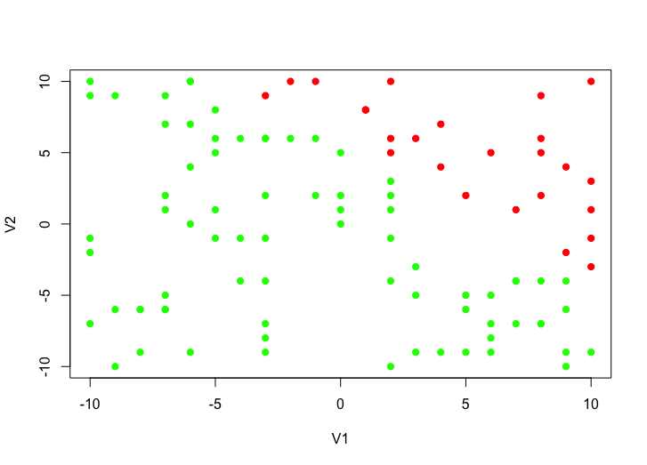
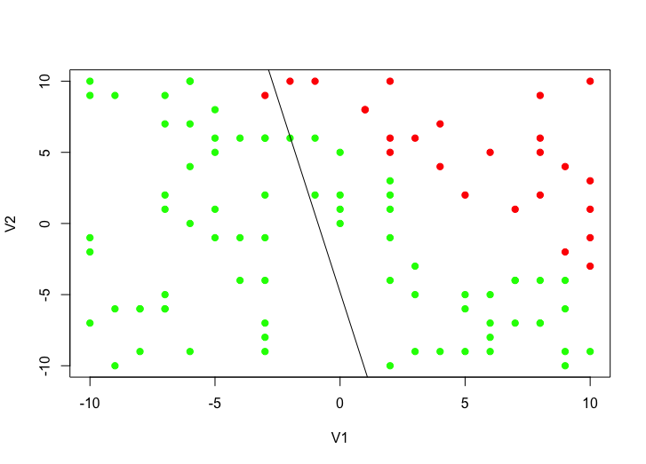
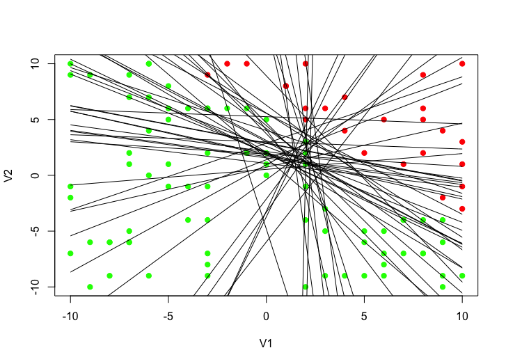
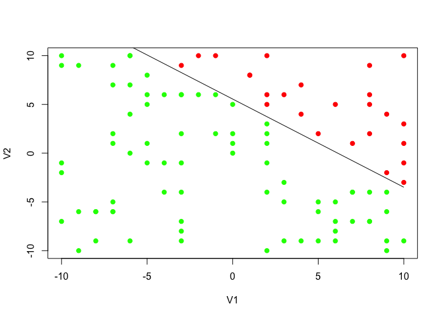

Data science and engineering are aspiring disciplines in IT.
As our digital world is flooded with data, people who know how to handle that are needed.
Not only big players, like Facebook and Google, collect data - everybody does it.

*Why shouldn't they?*

It's not like storage is expensive or writing the code to gather it is complicated.
Collecting data is easy.
Extracting information from it and subsequently gain knowledge is a more challenging task.
And it's definitely one that will occupy us for the next couple years.

Machine Learning (ML) is an emerging topic in this field.
The basic idea is to write algorithms that can learn patterns from provided data.
We can then use these patterns to answer questions about unknown data objects.

One very popular learning method within ML is called **supervised learning**.
The following example illustrates how this works:

The applications' aim is to detect cancer based on X-rays.
During the training phase it analyses millions of pictures.
Each picture comes with the information whether it shows cancer or not.
The algorithms tries to find patterns to be able to classify the training data.
After training, the algorithm will be able to determine whether an image shows cancer or not.
Now it can also detect cancer in image that were not included in the training data.

Not all problems can or should be solved with ML.
Finding the square root of a number is an example for that, because it's better answered with mathematics.

Problems where ML is applicable have these characteristics:
- they have an underlying pattern
- there is no mathematical solution
- a lot of data is accessible

## Getting Started
At first Machine Learning seems like this super complicated topic that only experts can grasp, let alone code.
After all we are talking about coding an application that is able to learn - pretty hardcore!

It's actually not as hard as it might sound.
I'm going to explain the code for a simple classification algorithm written in R.

### What is R?
R is one of the dominant programming languages when it comes to ML and data science.
There are a lot of resources and libraries to use, which makes it very attractive.
Another, probably even more, popular choice is Python.

At first R syntax looks strange and it definitely needs a few hours of frustration to get used to it.
Once one overcomes these obstacles and practice the basic operations, R gets pretty powerful.

### Perceptron Learning Algorithm (PLA)
The PLA in its basic form is a very easy to understand algorithm that is able to classify data points.
A perceptron is a function that takes inputs, applies weights, sums them up.
Based on whether the sum is bigger than a certain threshold it will output an binary result.
One condition for using this algorithm is that the data has to be linearly separable.
Otherwise it won't work.

The learning process of the PLA is to adjust the weights so inputs are interpreted correctly.

We will start with random weights and use it to classify all data points from our training set.
Then we can pick one random element out of all misclassified points.
We know which ones are misinterpreted because we know the "true" output of our training data.
Next we adjust the weights so the random element produces the correct output.
These steps then get repeated until there are no mismatches.

## Implementation
First we need some kind of data that is linearly separable.
For this demonstration I wrote the target function (= the unknown "truth") myself.
It takes a data object with two attributes and returns a binary value based on their value.

```R
target <- function(x) {
  if (x[1] + x[2] > 5) {
    return(-1)
  } else {
    return(1)
  }
}
```

Based on this we can generate our data set with 100 elements.
Each element will have two attributes ranged -10 to 10 and the output of the target function (-1/1).

```R
N <- 100

D <- data.frame()
for (i in 1:N) {
  D[i,1] <- sample(-10:10, 1)
  D[i,2] <- sample(-10:10, 1)
  D[i,"y"] <- target(D[i,])
}
```

This is actually the starting point for our ML application.
Imagine we only know this data set and need to learn about the classification criteria of the points.

A first good step is to visualize the data to get a better feeling for it.
```R
plot(D[c(1,2)], col = ifelse(D$y < 0, 'red', 'green'))
```

<figure>
    </img>
    <figcaption>The classification criteria is obvious, but still we want to solve this problem using a PLA</figcaption>
</figure>

Next we need our hypothesis function that will classify elements based on the weights.
I transformed the if statement from `x1 * w1 + x2 * w2 > threshold` to `x0 * w0 + x1 * w1 + x2 * w2 > 0`, `x0 = 1` for all elements.
This way the threshold is just another weight that the algorithm can adjust to find a fitting solution.

```R
# This returns an vector with 3 random numbers between -1 and 1
w <- c(runif(3))

hypothesis <- function(x) {
  input <- c(1, unlist(x))
  if (input[1] * w[1] + input[2] * w[2] + input[3] * w[3] > 0) {
    return(1)
  } else {
    return(-1)
  }
}
```

To see what we have so far, let's plot the random separation line to our data points.

```R
k <- -(w[2]/w[3])
d <- -(w[1]/w[3])
curve(x * k + d, add=TRUE)
```

<figure>
    </img>
    <figcaption>The first attempt to find the distinction of red and green points - basically it's a random line.</figcaption>
</figure>

All we have to do is repeating the process of adjusting the weights to match a misclassified point.
Doing so will result in a function that can predict the value of every item in the data set without error.

```R
# while there are misclassified data points...
while (nrow(D[apply(D, c(1), hypothesis) != D['y'],]) > 0) {

  # retrieve all misclassified elements with the current weights
  m <- D[apply(D, c(1), hypothesis) != D['y'],]
  m.length <- nrow(m)

  # choose a random misclassified data point
  random <- sample(1:m.length, 1)
  e <- m[random,]

  # adjust the weigths to match the random mismatch
  w <- w + e$y * c(1, as.numeric(e[1:2]))
}
```

All the "adjusting magic" happens here:

`w <- w + e$y * c(1, as.numeric(e[1:2]))`

The value of the data object is added or subtracted from the current weights - depending whether `y` is positive or negative.
The first weight always has the value 1.
This is due to the threshold, described earlier.

<figure>
    </img>
    <figcaption>47 iterations later the algorithm found weights that please all elements in the data set.</figcaption>
</figure>

Now we found a solution that classifies all our training data properly.
Based on this we assume that it will also work with data that wasn't included in the data set.
A procedure to test this is to train the algorithm only with a percentage of the available data.
Then use the other part to test see how the algorithm performs.

Because this example used artificially created data this will not be further evaluated.

<figure>
    </img>
    <figcaption>The final result shows a line that perfectly separates the red from the green points.</figcaption>
</figure>

We used the position of an element for classification, which seems a little specific.
The algorithm also works in more generic ways.
In fact every kind of information can be used as input.
Also the algorithm isn't limited to two-dimensional data objects.
This was chosen to easily illustrate what's going on.

## Conclusion
The aim of this post is to demystify the field of ML a little bit.
You should see that ML is not rocket science.
The applications learn independently, you choose a suitable algorithm and provide the data.

Interested in learning more about ML?

Here's a list of resources that I found interesting.
- [Talk about ML in the browser](https://www.youtube.com/watch?v=VQRzWiscu4U)
- [Free ML universtiy course](https://www.work.caltech.edu/telecourse.html)
- [Talk about the future role of AI](https://www.ted.com/talks/kevin_kelly_how_ai_can_bring_on_a_second_industrial_revolution)
- [Introduction to Reinforcement Learning](https://deeplearning4j.org/reinforcementlearning.html)

Please feel free to leave a comment or follow me on [twitter](https://twitter.com/simon_rsp), where I'll post more ML related stuff.

[Here](https://gist.github.com/abisz/45108a0177781f7790169797800ce176) is a link to the complete code of the example.